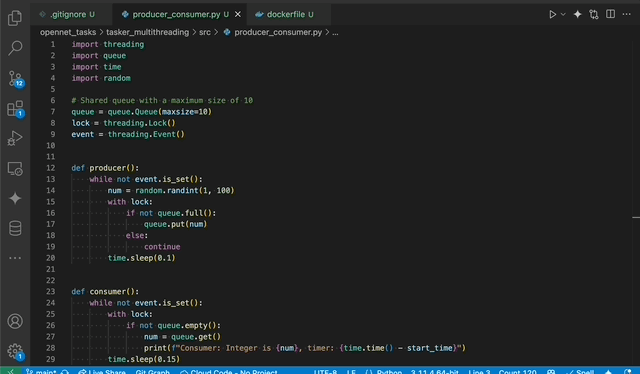

# How to run it
### using Python
```
pip install -r requirements.txt
python tasker_multithreading/src/producer_consumer.py
```
### using Docker
```
docker build -t tasker_1 .
docker run tasker_1
docker logs [CONTAINER]
```
# Structure of directory
```
.
├── README.md
├── dockerfile
├── requirements.txt
├── src
│   └── producer_consumer.py
└── static
    └── tasker_multithreading.gif
```
src: including the main source code of python file.  
static: to save the static file as gif, picture, html and else.  
# Requirements.txt
By using the builtin module in python, requirements is empty for this task.  
# Gif of demonstration
  
# Dockerfile
```
FROM python:3.11-alpine
WORKDIR /tasker_multithreading
COPY requirements.txt requirements.txt
RUN pip install -r requirements.txt
COPY . .
CMD ["python", "src/producer_consumer.py"]
```